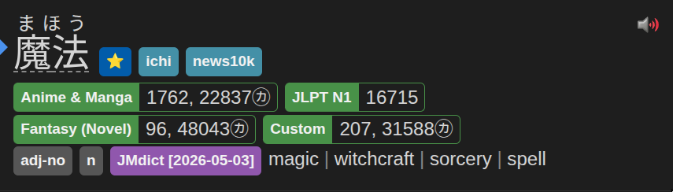

# Yomitan Frequency

A browser-based tool for building custom Japanese frequency dictionaries for
[Yomitan](https://github.com/themoeway/yomitan). Create your own custom frequency 
dictionary based on what you are interested in.

## What does Yomitan Frequency Do?

The currently recommended yomitan frequency dictionaries span large corpuses across many domains (manga, novels, non-fiction, aozora bunko etc.).
This may seem fine at first, but in general, learners do not wish to learn every single word in a language, and would prefer to learn vocabulary
that will be relevant to their goals and interests. To do this, they would benefit strongly from having a frequency list that is specified to the 
areas of Japanese that they care about. This is what Yomitan Frequency does. You can combine and merge all areas of Japanese that you are interested
in into one dictionary and import it to yomitan for use. So when you aren't sure whether to mine a word or not, you will be able to make a more informed
decision.

It offers three workflows:

- **Dictionaries** - One-click downloads of pre-built dictionaries covering
  Anime, Manga, Drama, Novel, Video Game and Visual Novel plus per-genre breakdowns.
- **Create** - Search Jiten's deck catalogue, pick specific titles you've
  watched or read, and merge them into a single Yomitan dictionary.
- **Combiner** - Drag-and-drop any Yomitan frequency `.zip` files you
  already have and average them into one.



## Installation

The combiner is a website, no install needed. Open it in your browser.

## Building

Install [Node.js](https://nodejs.org/) and npm.

```bash
cd frontend
npm install        # set up the environment
npm run dev        # start the Vite dev server
npm run build      # type-check + production build (outputs to frontend/dist/)
npm test           # run the test suite once
npm run test:watch # run tests in watch mode
```

By default the dev server talks to `https://api.jiten.moe/api`. To point at a
local `Jiten.Api`, append `?api=…` to the URL (e.g.
`http://localhost:5173/?api=https://localhost:7299/api`). In production,
`/api/*` is rewritten to `api.jiten.moe` by Vercel.

## Contributing

New contributors welcome. Browse the
[issue tracker](https://github.com/AaronTimony/yomitan-frequency-combiner/issues)
or you can open an issue yourself and I will get to it whenever possible.

## Privacy & License

- [Privacy policy](./PRIVACY-POLICY.md) — no personal data is collected or
  transmitted; everything runs locally. The site uses Umami for anonymous,
  aggregate analytics.
- Licensed under the terms in [LICENSE](./LICENSE).

## Third-Party Libraries

| Name              | License type            | Link                                          |
|-------------------|-------------------------|-----------------------------------------------|
| jszip             | MIT OR GPL-3.0-or-later | https://github.com/Stuk/jszip                 |
| tailwindcss       | MIT                     | https://github.com/tailwindlabs/tailwindcss   |
| @tailwindcss/vite | MIT                     | https://github.com/tailwindlabs/tailwindcss   |
| vite              | MIT                     | https://github.com/vitejs/vite                |
| vitest            | MIT                     | https://github.com/vitest-dev/vitest          |
| typescript        | Apache-2.0              | https://github.com/microsoft/TypeScript       |
| jsdom             | MIT                     | https://github.com/jsdom/jsdom                |
| esbuild           | MIT                     | https://github.com/evanw/esbuild              |

Frequency data and per-deck Yomitan zips are sourced from
[Jiten](https://jiten.moe) via its public API.
